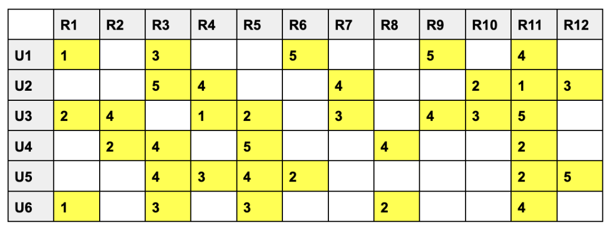
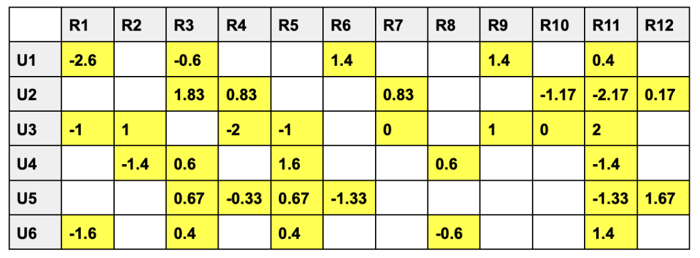
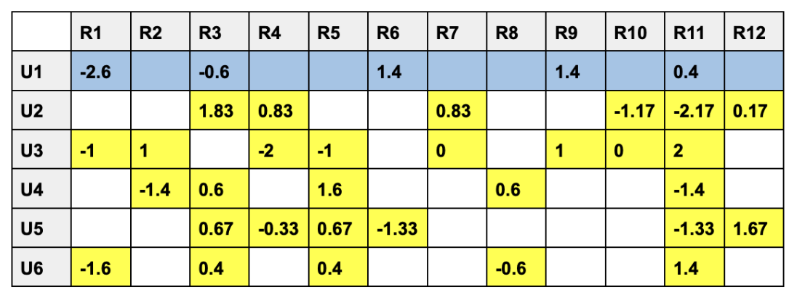
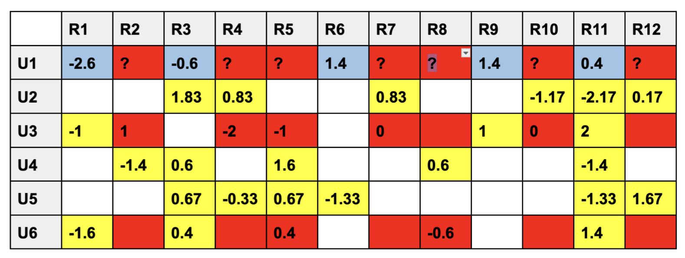

# Nom Appetit Recommendation Algorithm 

Nom Appetit's Restaurant Recommendation Engine, powered by Collaborative Filtering.

## Environment Setup

To set up the required python modules, use the provided `requirements.txt` file:

`$ python3 -m pip install -r requirements.txt`

## Documentation

### Rating Reccomendation 

The original database has been restructured, with users represented as rows and restaurants as columns. Each cell in the table denotes the rating provided by a specific user for a particular restaurant. Blank cells signify no reviews, although in the implementation, they are typically replaced with zeros for consistency in data representation.

To enhance the comparison of ratings among users and mitigate the impact of missing ratings, we employ normalization. This process involves subtracting the mean rating of each user's row from each individual rating within that row. By doing so, we effectively adjust for user-specific tendencies, such as being consistently harsh or lenient in their ratings. This normalization method helps capture the intuition of similar users more effectively, as missing ratings are treated as "average," resulting in a fairer assessment across users with varying rating behaviors.

Once we have normalized the ratings for each user, we can proceed to calculate the cosine similarity between the current user and all other users in the database. This similarity metric quantifies the angle between the vectors representing the ratings of different users in a multidimensional space. Users with a cosine similarity value closer to 1 are considered more similar, while those closer to 0 are less similar. By identifying users with high cosine similarity to the current user, we can determine which users' preferences align most closely, enabling more accurate recommendations based on collaborative filtering.

Using cosine similarity, we identified that `U3` and `U6` are the most similar to our current user `U1`. With this information, we can estimate a rating for the missing restaurants using a weighted average.

### Poll Filtering

We convert the list of restaurants and their ratings and then cross-validate them with the user's preferences obtained from the poll.